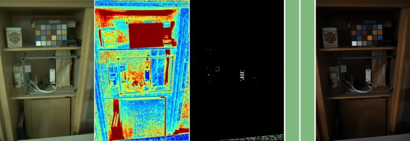

# On Finding Gray Pixels
Matlab Code accompanying the paper **On Finding Gray Pixels**. [[**arXiv**]](https://arxiv.org/abs/1901.03198)


From left to right: (a) input image. (b) computed grayness index GI. darker blue indicates higher degree of grayness. (c) the N % most gray pixels rendered using the corresponding pixel color (greenish) in (a). (d) estimated illumination color. (e) ground truth color. (f) corrected image using (d).

**If you use grayness index code or results, please consider citing following paper**:

```latex
@inproceedings{qian2019cvpr,
  title={On Finding Gray Pixels},
  author={Qian, Yanlin and K{\"a}m{\"a}r{\"a}inen, Joni-Kristian and Nikkanen, Jarno and Matas, Jiri},
  booktitle={IEEE International Conference of Computer Vision and Pattern Recognition},
  year={2019}
}
```

**If you use classic gray pixel code or results, please consider citing following paper**:

```latex
@inproceedings{yang2015efficient,
  title={Efficient illuminant estimation for color constancy using grey pixels},
  author={Yang, Kai-Fu and Gao, Shao-Bing and Li, Yong-Jie},
  booktitle={CVPR},
  year={2015}
}
```

**If you use mean-shifted gray pixel code or results ([[**here**]](https://github.com/yanlinqian/Mean-shifted-Gray-Pixel) ), please consider citing following paper**:

```latex
@inproceedings{qian2019vissap,
  title={Revisiting Gray Pixel for Statistical Illumination Estimation},
  author={Qian, Yanlin and Purtuz, Said and Nikkanen, Jarno and K{\"a}m{\"a}r{\"a}inen, Joni-Kristian and Matas, Jiri},
  booktitle={International Conference of Computer Vision Theory and Applications},
  year={2019}
}
```